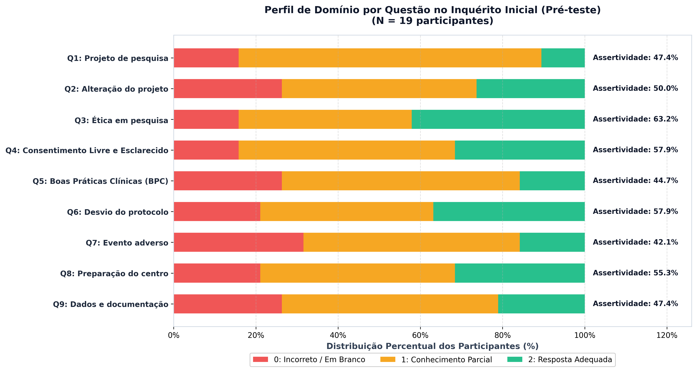
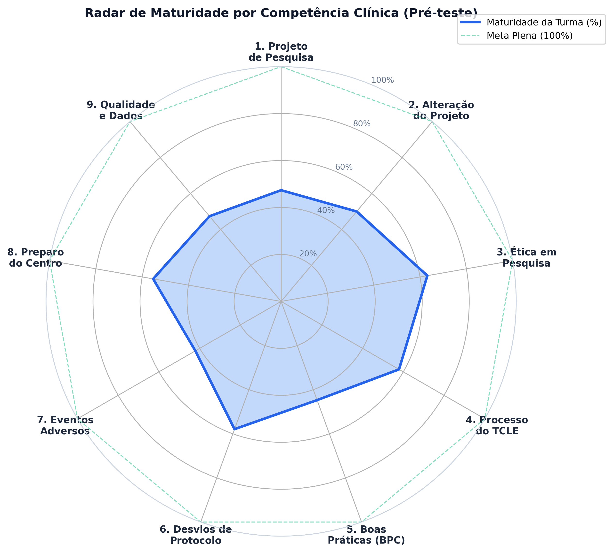
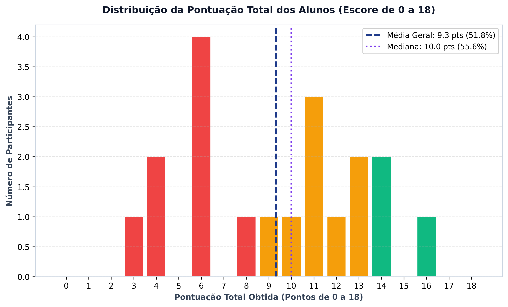
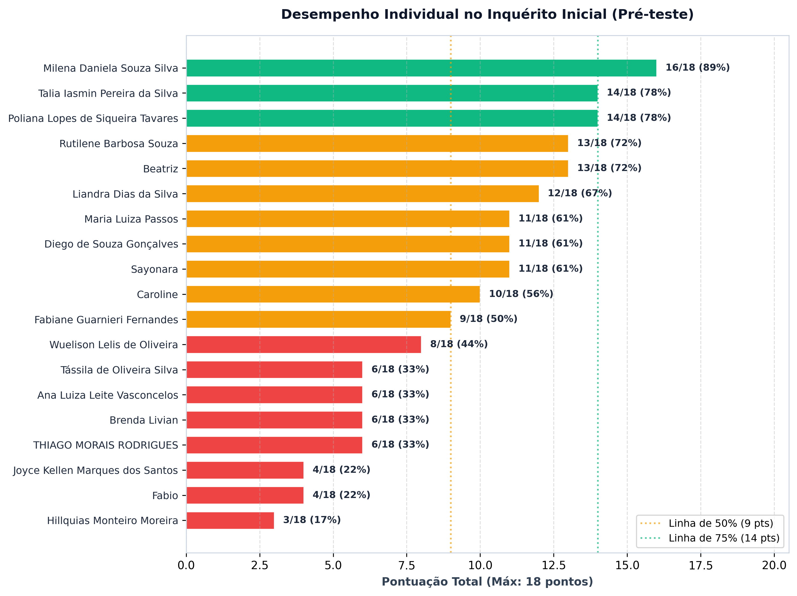
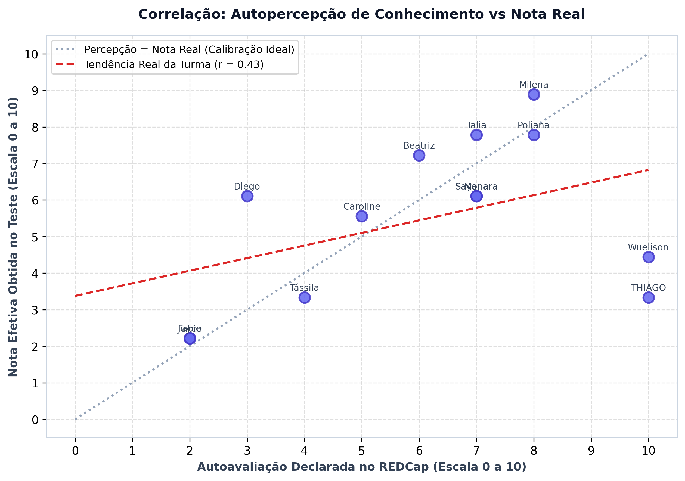
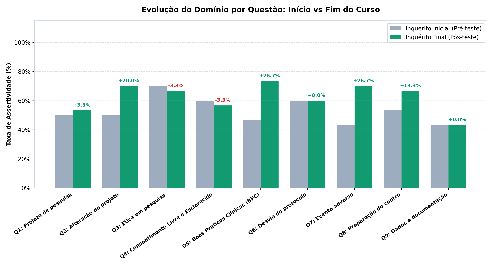
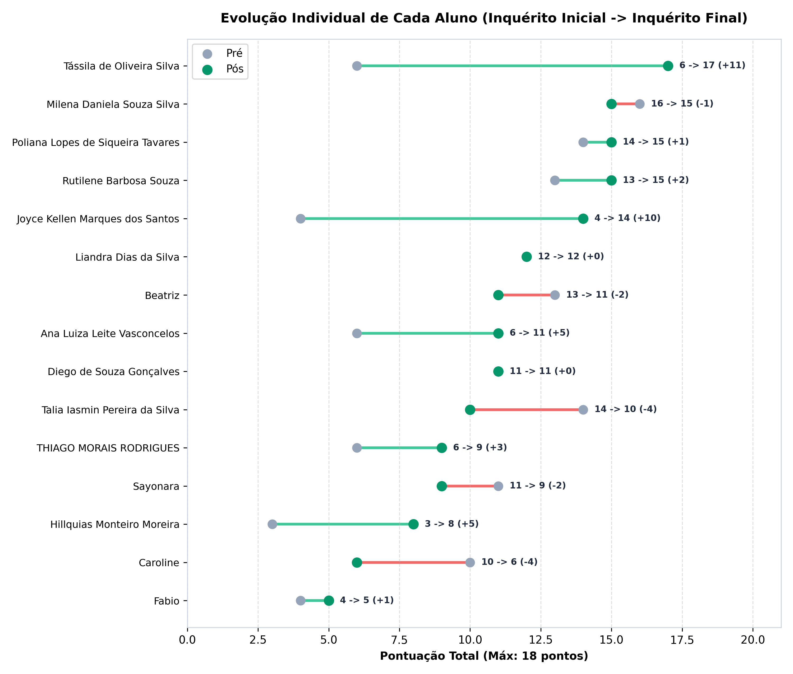

# 📊 Relatório Executivo: Inquérito de Conhecimentos em Pesquisa Clínica
> **Curso de Pesquisa Clínica - CEPEM / FIOCRUZ**  
> **Status da Avaliação:** Momento 1 (Pré-teste Inicial concluído - N = 19 participantes)  
> **Critério de Avaliação:** Rubrica oficial REDCap (0 = Incorreto/Sem resposta; 1 = Parcial; 2 = Adequado) — Escore máximo de 18 pontos.

---

## 📌 1. Visão Geral e Indicadores-Chave (KPIs)

| Indicador | Valor Obtido | Status / Interpretação |
| :--- | :---: | :--- |
| **Participantes Avaliados** | **19** | Amostra completa do 1º inquérito |
| **Média Geral da Turma** | **9.32 / 18.0 pts** (51.8%) | Nível Intermediário Inicial |
| **Mediana do Escore** | **10.0 pts** | 50% dos alunos pontuaram até 10 pts |
| **Desvio Padrão** | **± 3.90 pts** | Heterogeneidade prévia moderada |
| **Maior Domínio Prévio** | **Q3: Ética em pesquisa** (63.2%) | Conceito consolidado na maioria |
| **Ponto Crítico / Menor Domínio** | **Q7: Evento adverso** (42.1%) | Foco prioritário de reforço nas aulas |

---

## 📈 2. Desempenho por Competência e Gabarito Oficial

### Detalhamento por Questão do Inquérito:

| Questão | Competência Avaliada | Assertividade | Resposta Adequada (2) | Parcial (1) | Incorreto/Vazio (0) |
| :---: | :--- | :---: | :---: | :---: | :---: |
| **Q1** | Projeto de pesquisa | **47.4%** | 2 (11%) | 14 (74%) | 3 (16%) |
| **Q2** | Alteração do projeto | **50.0%** | 5 (26%) | 9 (47%) | 5 (26%) |
| **Q3** | Ética em pesquisa | **63.2%** | 8 (42%) | 8 (42%) | 3 (16%) |
| **Q4** | Consentimento Livre e Esclarecido | **57.9%** | 6 (32%) | 10 (53%) | 3 (16%) |
| **Q5** | Boas Práticas Clínicas (BPC) | **44.7%** | 3 (16%) | 11 (58%) | 5 (26%) |
| **Q6** | Desvio do protocolo | **57.9%** | 7 (37%) | 8 (42%) | 4 (21%) |
| **Q7** | Evento adverso | **42.1%** | 3 (16%) | 10 (53%) | 6 (32%) |
| **Q8** | Preparação do centro | **55.3%** | 6 (32%) | 9 (47%) | 4 (21%) |
| **Q9** | Dados e documentação | **47.4%** | 4 (21%) | 10 (53%) | 5 (26%) |

### 🕸️ Radar de Maturidade da Turma

> **Diagnóstico Pedagógico:**
> - A questão com **menor índice de assertividade** foi a **Q7 (Evento adverso)**, com apenas 42.1% de aproveitamento. Observou-se que a maioria dos alunos desconhecia os dois pilares obrigatórios ou deixou em branco.
> - Já a questão com **maior índice** foi a **Q3 (Ética em pesquisa)**, onde 42% demonstraram resposta plenamente adequada ou parcial.

---

## 👥 3. Distribuição e Desempenho dos Participantes

### Tabela Geral de Participantes (Ordem Decrescente de Pontuação):

| Record ID | Participante | Sexo | Pontos (0-18) | Nota (0-10) | % Acerto | Classificação de Domínio |
| :---: | :--- | :---: | :---: | :---: | :---: | :--- |
| 17 | **Milena Daniela Souza Silva** | Feminino | **16** | 8.9 | 88.9% | Avançado / Alto Domínio |
| 21 | **Poliana Lopes de Siqueira Tavares** | Feminino | **14** | 7.8 | 77.8% | Avançado / Alto Domínio |
| 4 | **Talia Iasmin Pereira da Silva** | Feminino | **14** | 7.8 | 77.8% | Avançado / Alto Domínio |
| 7 | **Rutilene Barbosa Souza** | Feminino | **13** | 7.2 | 72.2% | Intermediário / Conhecimento Parcial |
| 16 | **Beatriz** | Feminino | **13** | 7.2 | 72.2% | Intermediário / Conhecimento Parcial |
| 14 | **Liandra Dias da Silva** | Feminino | **12** | 6.7 | 66.7% | Intermediário / Conhecimento Parcial |
| 3 | **Sayonara** | Feminino | **11** | 6.1 | 61.1% | Intermediário / Conhecimento Parcial |
| 20 | **Maria Luiza Passos** | Feminino | **11** | 6.1 | 61.1% | Intermediário / Conhecimento Parcial |
| 15 | **Diego de Souza Gonçalves** | Masculino | **11** | 6.1 | 61.1% | Intermediário / Conhecimento Parcial |
| 18 | **Caroline** | Feminino | **10** | 5.6 | 55.6% | Intermediário / Conhecimento Parcial |
| 12 | **Fabiane Guarnieri Fernandes** | Feminino | **9** | 5.0 | 50.0% | Intermediário / Conhecimento Parcial |
| 11 | **Wuelison Lelis de Oliveira** | Masculino | **8** | 4.4 | 44.4% | Básico / Necessita Fortalecimento |
| 5 | **Ana Luiza Leite Vasconcelos** | Feminino | **6** | 3.3 | 33.3% | Básico / Necessita Fortalecimento |
| 6 | **Tássila de Oliveira Silva** | Feminino | **6** | 3.3 | 33.3% | Básico / Necessita Fortalecimento |
| 10 | **Brenda Livian** | Feminino | **6** | 3.3 | 33.3% | Básico / Necessita Fortalecimento |
| 8 | **THIAGO MORAIS RODRIGUES** | Masculino | **6** | 3.3 | 33.3% | Básico / Necessita Fortalecimento |
| 13 | **Fabio** | Masculino | **4** | 2.2 | 22.2% | Básico / Necessita Fortalecimento |
| 19 | **Joyce Kellen Marques dos Santos** | Feminino | **4** | 2.2 | 22.2% | Básico / Necessita Fortalecimento |
| 9 | **Hillquias Monteiro Moreira** | Masculino | **3** | 1.7 | 16.7% | Básico / Necessita Fortalecimento |

---

## 🎯 4. Autopercepção vs Desempenho Efetivo

No inquérito, os alunos responderam a um controle deslizante (*slider*) avaliando: *'Avalie o quanto você sabe, hoje, sobre o assunto deste curso (0 a 100)'*.

> **Análise de Calibração Metacognitiva:**  
> A comparação entre a autopercepção e a nota real revela participantes com boa calibração (autopercepção alinhada à nota), bem como participantes que subestimaram ou superestimaram seus conhecimentos iniciais, um fenômeno comum antes da introdução formal aos rigorosos padrões regulatórios de Pesquisa Clínica.

---

## 🚀 5. Comparativo Pré vs Pós-teste (Momento 2)

### 🎉 Resultados Comparativos Consolidados!

- **Média Pré-teste:** 9.53 pts (53.0%)  
- **Média Pós-teste:** 11.20 pts (62.2%)  
- **Evolução Média Absoluta:** **+1.67 pontos**  
- **Ganho Normalizado de Hake (g):** **19.7%**  

---

## 📋 6. Gabarito Oficial e Critérios de Correção (Rubrica REDCap)

### Q1: Projeto de pesquisa
**Enunciado:** *1. Cite quatro elementos essenciais que devem constar em um projeto ou protocolo de pesquisa.*  

**Gabarito Esperado:**  
> Projeto completo, TCLE/TALE, anuência das instituições envolvidas e declarações do pesquisador (ou elementos estruturais: justificativa, objetivos, metodologia, riscos/benefícios, critérios de elegibilidade, cronograma, orçamento).  

**Rubrica de Intensidade de Acerto:**  
- **0 pontos:** Não respondeu, resposta incorreta ou menos de 2 elementos citados.  
- **1 ponto:** Conhecimento parcial: citou 2 ou 3 elementos válidos.  
- **2 pontos:** Resposta adequada: citou 4 ou mais elementos essenciais.  

### Q2: Alteração do projeto
**Enunciado:** *2. Um procedimento de um projeto já aprovado precisa ser alterado. Qual deve ser a conduta do pesquisador antes de implementar a alteração?*  

**Gabarito Esperado:**  
> Documentar toda a alteração, submeter ao CEP uma emenda ao projeto e, após aprovação ética, treinar a equipe e implementar as mudanças.  

**Rubrica de Intensidade de Acerto:**  
- **0 pontos:** Não respondeu, resposta incorreta ou propôs implementar sem aprovação do CEP.  
- **1 ponto:** Conhecimento parcial: citou submeter ao CEP/emenda sem citar aprovação prévia/documentação, ou apenas preparo interno sem CEP.  
- **2 pontos:** Resposta adequada: indicou submissão formal de emenda ao CEP, aguardar aprovação ética e documentar/treinar antes de implementar.  

### Q3: Ética em pesquisa
**Enunciado:** *3. Em que momento uma pesquisa envolvendo seres humanos deve ser submetida à apreciação ética e por quê?*  

**Gabarito Esperado:**  
> Antes do início de qualquer atividade/procedimento do projeto. Por quê: garantir a proteção dos direitos, dignidade, integridade e bem-estar dos participantes e cumprimento das normas éticas.  

**Rubrica de Intensidade de Acerto:**  
- **0 pontos:** Não respondeu ou indicou momento incorreto (durante ou após início).  
- **1 ponto:** Conhecimento parcial: citou o momento correto (antes do início) mas não justificou, ou justificou sem definir o momento prévio.  
- **2 pontos:** Resposta adequada: indicou o momento prévio correto (antes de qualquer atividade) E justificou com a proteção/ética dos participantes.  

### Q4: Consentimento Livre e Esclarecido
**Enunciado:** *4. Em uma frase, qual é a principal finalidade do processo de consentimento livre e esclarecido?*  

**Gabarito Esperado:**  
> Garantir que o participante decida de forma livre, autônoma e esclarecida sobre sua participação na pesquisa, após receber e compreender todas as informações necessárias.  

**Rubrica de Intensidade de Acerto:**  
- **0 pontos:** Não respondeu ou definição incorreta/incompatível.  
- **1 ponto:** Conhecimento parcial: abordou apenas o dever de informar/esclarecer ou apenas o ato de coletar assinatura/autorização sem enfatizar a autonomia voluntária.  
- **2 pontos:** Resposta adequada: contemplou expressamente a autonomia/decisão livre e voluntária e a compreensão/esclarecimento das informações.  

### Q5: Boas Práticas Clínicas (BPC)
**Enunciado:** *5. Cite dois objetivos fundamentais das Boas Práticas na condução de uma pesquisa clínica.*  

**Gabarito Esperado:**  
> 1) Proteger os direitos, a segurança e o bem-estar dos participantes da pesquisa. 2) Assegurar a qualidade, integridade, rastreabilidade e confiabilidade dos dados e resultados.  

**Rubrica de Intensidade de Acerto:**  
- **0 pontos:** Não respondeu ou citou objetivos alheios às BPC.  
- **1 ponto:** Conhecimento parcial: abordou apenas 1 dos 2 pilares (somente proteção dos participantes OU somente qualidade/integridade dos dados).  
- **2 pontos:** Resposta adequada: abordou claramente os 2 pilares centrais das BPC (proteção dos sujeitos E qualidade/confiabilidade dos dados).  

### Q6: Desvio do protocolo
**Enunciado:** *6. A equipe identificou que um procedimento não foi realizado conforme previsto no protocolo. Cite duas ações que devem ser tomadas a partir dessa identificação.*  

**Gabarito Esperado:**  
> 1) Adotar ações corretivas e preventivas (CAPA) para mitigar o risco de recorrência. 2) Realizar o registro formal e as comunicações/notificações aplicáveis (ao CEP, patrocinador, coordenação).  

**Rubrica de Intensidade de Acerto:**  
- **0 pontos:** Não respondeu ou ações inadequadas.  
- **1 ponto:** Conhecimento parcial: citou apenas o registro/notificação ou apenas a correção/prevenção.  
- **2 pontos:** Resposta adequada: citou ambas as ações fundamentais (registro/notificação regulatória E ação corretiva/preventiva/mitigadora).  

### Q7: Evento adverso
**Enunciado:** *7. Cite duas ações que devem ser adotadas pela equipe ao identificar um evento adverso durante a condução de um estudo clínico.*  

**Gabarito Esperado:**  
> 1) Prestar assistência necessária imediata ao participante, garantindo sua segurança, manejo clínico e acompanhamento adequado. 2) Registrar e comunicar/notificar ao patrocinador/CEP/autoridades regulatórias dentro dos prazos vigentes.  

**Rubrica de Intensidade de Acerto:**  
- **0 pontos:** Não respondeu ou conduta incorreta.  
- **1 ponto:** Conhecimento parcial: citou apenas a assistência clínica ou apenas o registro/notificação.  
- **2 pontos:** Resposta adequada: citou a assistência/segurança do paciente E a notificação/registro aos responsáveis.  

### Q8: Preparação do centro
**Enunciado:** *8. Cite três aspectos que devem ser avaliados para determinar se um centro está preparado para conduzir um estudo clínico.*  

**Gabarito Esperado:**  
> 1) Equipe qualificada e treinada. 2) Infraestrutura, instalações e recursos adequados (laboratório, farmácia, equipamentos). 3) Capacidade de recrutamento e retenção de participantes (população elegível no cronograma previsto).  

**Rubrica de Intensidade de Acerto:**  
- **0 pontos:** Não respondeu ou nenhum aspecto pertinente.  
- **1 ponto:** Conhecimento parcial: citou 1 ou 2 aspectos válidos.  
- **2 pontos:** Resposta adequada: citou 3 ou mais aspectos estruturantes (equipe, estrutura física e recrutamento/população/qualidade).  

### Q9: Dados e documentação
**Enunciado:** *9. Cite dois cuidados essenciais para garantir qualidade e rastreabilidade dos dados e documentos de uma pesquisa.*  

**Gabarito Esperado:**  
> 1) Registrar os dados de forma completa, precisa, legível e contemporânea (no momento adequado), com autoria identificada (princípios ALCOA). 2) Manter os documentos organizados, armazenados de forma segura, com controle de acesso, sigilo e rastreabilidade de versões.  

**Rubrica de Intensidade de Acerto:**  
- **0 pontos:** Não respondeu ou resposta genérica/incorreta.  
- **1 ponto:** Conhecimento parcial: citou apenas 1 cuidado válido.  
- **2 pontos:** Resposta adequada: citou 2 ou mais cuidados consistentes (registro contemporâneo/preciso + segurança/controle de acesso/organização).  

